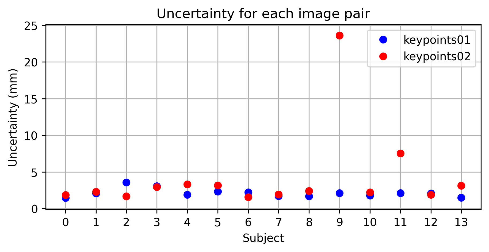

Generated keypoints as used in the 2024 MIDL paper REINDIR: Repeated Embedding Infusion for Neural Deformable Image Registration. The procedure for generating these keypoints is detailed in appendix B of the paper.

Note that two image pairs failed to converge in most seeds, resulting in large potential errors. These are the pairs in keypoints02 for subjects 9 and 11, as shown below:

